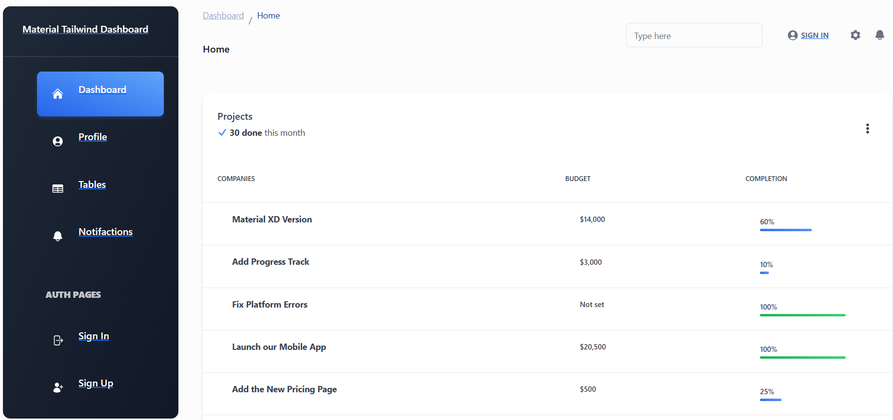

`Url: `https://jose-daniel-g.github.io/dashboard_taliwind/
[🚀 Ver demo de dashboard_taliwind](https://jose-daniel-g.github.io/dashboard_taliwind/)

```
ng build `
  --configuration production `
  --base-href "https://jose-daniel-g.github.io/dashboard_tailwind/"

npx angular-cli-ghpages `
  --dir=dist/prueba-frontend/browser

```

**Si no funciona/ o ya a sido cargado antes**
```
ng build --configuration production --base-href "/dashboard_tailwind/"
```